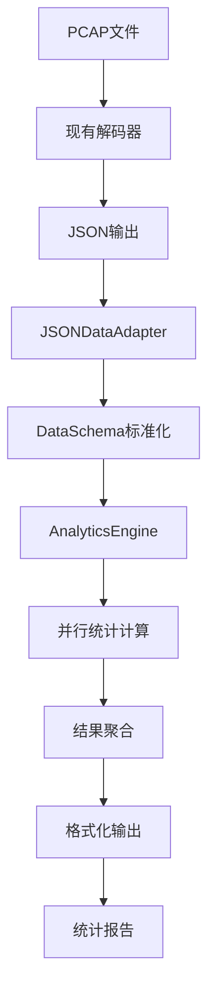

# Analytics模块设计方案

## 1. 设计概述

本文档详细描述了为PCAP解码器项目新增的`analytics`数据统计分析模块的设计方案。该模块基于现有解码器的JSON输出进行二次数据分析，支持多维度统计和可扩展的插件化架构。

## 2. 核心设计原则

### 2.1 依赖隔离原则
- **单向依赖**: `analytics`模块依赖`core`模块的输出，但`core`模块不依赖`analytics`
- **数据适配器模式**: 通过适配器层隔离数据格式变化的影响
- **版本兼容性**: 支持多个版本的数据格式，向前兼容

### 2.2 可扩展性原则
- **插件化架构**: 新的统计项作为插件动态注册和加载
- **配置驱动**: 通过配置文件定义启用的统计项和参数
- **模块化设计**: 按统计类别组织，便于独立开发和维护

### 2.3 性能优化原则
- **并行处理**: 支持多统计项并行计算
- **流式处理**: 支持大文件的流式加载和处理
- **内存管理**: 避免大数据集的完整加载

## 3. 目录结构设计

```
Pkt2TXT/
├── core/                    # 现有核心模块
│   ├── scanner.py
│   ├── decoder.py
│   ├── processor.py
│   ├── formatter.py
│   └── ...
├── utils/                   # 现有工具模块
├── analytics/               # 新增：数据统计模块 ⭐
│   ├── __init__.py         # 模块入口，公共接口
│   ├── config.py           # 配置管理
│   ├── core/               # 统计核心组件
│   │   ├── __init__.py
│   │   ├── analyzer.py     # 统计分析引擎
│   │   ├── aggregator.py   # 数据聚合器
│   │   └── reporter.py     # 报告生成器
│   ├── adapters/           # 数据适配器
│   │   ├── __init__.py
│   │   ├── json_adapter.py # JSON数据适配器
│   │   └── schema.py       # 数据模式定义
│   ├── stats/              # 统计计算模块
│   │   ├── __init__.py
│   │   ├── base.py         # 统计基类
│   │   ├── traffic.py      # 流量统计
│   │   ├── protocol.py     # 协议统计
│   │   ├── security.py     # 安全统计（未来扩展）
│   │   └── performance.py  # 性能统计（未来扩展）
│   ├── outputs/            # 输出格式化
│   │   ├── __init__.py
│   │   ├── json_output.py  # JSON输出
│   │   ├── csv_output.py   # CSV输出
│   │   └── html_output.py  # HTML报告
│   └── plugins/            # 扩展插件目录
│       ├── __init__.py
│       └── custom/         # 自定义统计插件
├── analytics_cli.py        # 新增：独立CLI工具
├── cli.py                  # 现有CLI（可选扩展）
└── tests/
    ├── test_analytics/     # 新增：统计模块测试
    └── ...
```

## 4. 核心组件设计

### 4.1 数据适配器层（adapters/）
负责处理不同数据源的适配和标准化：

- **JSONDataAdapter**: 读取和解析现有JSON输出
- **DataSchema**: 标准化的数据结构定义
- **DataValidator**: 数据完整性验证

**设计优势**:
- 隔离数据格式变化的影响
- 支持多种数据源格式
- 提供统一的数据接口

### 4.2 统计基类系统（stats/base.py）
定义统计项的通用接口：

```python
# 统计项类型
StatisticsBase           # 基础统计接口
AggregableStatistics     # 可聚合统计（支持多文件聚合）
IncrementalStatistics    # 增量统计（支持实时更新）
ParameterizedStatistics  # 参数化统计（支持运行时配置）
```

**设计优势**:
- 统一的接口规范
- 支持多种统计模式
- 便于扩展和维护

### 4.3 插件注册系统
通过`StatisticsRegistry`管理所有统计项：

```python
# 注册统计项
statistics_registry.register(BasicTrafficStatistics, "traffic")
statistics_registry.register(ProtocolDistribution, "protocol")

# 动态创建实例
instance = statistics_registry.create_instance("basic_traffic")
```

**设计优势**:
- 动态发现和加载统计项
- 支持分类管理
- 便于配置驱动

### 4.4 分析引擎（core/analyzer.py）
协调各统计模块的执行：

```python
engine = AnalyticsEngine(enable_parallel=True)

# 单文件分析
results = engine.analyze_single_file("data.json")

# 批量分析
results = engine.analyze_directory("./data/", aggregate_results=True)
```

## 5. 数据流程设计



## 6. 扩展性设计

### 6.1 新增统计项
只需3步即可添加新的统计项：

1. **继承基类**:
```python
class NewStatistic(StatisticsBase):
    def calculate(self, data: DataSchema) -> StatisticsResult:
        # 实现统计逻辑
        pass
    
    def get_required_fields(self) -> List[str]:
        return ['packets', 'timestamp']
```

2. **注册统计项**:
```python
statistics_registry.register(NewStatistic, "custom")
```

3. **配置启用**:
```python
# 配置文件或代码中启用
engine.enable_statistics(['new_statistic'])
```

### 6.2 新增数据源
通过实现新的适配器支持不同数据格式：

```python
class CSVDataAdapter(DataAdapter):
    def load_single_file(self, file_path) -> DataSchema:
        # 实现CSV数据加载逻辑
        pass
```

### 6.3 新增输出格式
通过实现输出格式化器支持不同报告格式：

```python
class HTMLReporter(OutputFormatter):
    def generate_report(self, results) -> str:
        # 生成HTML报告
        pass
```

## 7. 配置系统设计

### 7.1 配置文件结构
```json
{
  "version": "1.0.0",
  "max_workers": 4,
  "enable_parallel": true,
  "statistics": {
    "traffic": {
      "basic_traffic": {"enabled": true},
      "packet_size_distribution": {
        "enabled": true,
        "parameters": {"bin_size": 64}
      }
    },
    "protocol": {
      "protocol_distribution": {"enabled": true}
    }
  },
  "output": {
    "directory": "./analytics_results",
    "formats": ["json", "html"]
  }
}
```

### 7.2 运行时配置
```python
# 动态启用/禁用统计项
engine.enable_statistics(['basic_traffic'])
engine.disable_statistics(['protocol_distribution'])

# 设置参数
stat = engine.statistics['packet_size_distribution']
stat.set_parameter('bin_size', 128)
```

## 8. 使用示例

### 8.1 基本使用
```bash
# 分析单个文件
python analytics_cli.py analyze -i data.json -o ./results

# 批量分析目录
python analytics_cli.py analyze -i ./data_dir -o ./results --aggregate

# 指定统计项
python analytics_cli.py analyze -i data.json -o ./results \
  --statistics basic_traffic --statistics protocol_distribution
```

### 8.2 编程接口
```python
from analytics import AnalyticsEngine

# 创建分析引擎
engine = AnalyticsEngine()

# 分析数据
results = engine.analyze_single_file("sample.json")

# 访问结果
traffic_stats = results['basic_traffic']
print(f"总包数: {traffic_stats.results['total_packets']}")
```

## 9. 优势总结

### 9.1 架构优势
- **松耦合**: 与现有模块解耦，不影响原有功能
- **高扩展**: 插件化架构，易于添加新功能
- **可维护**: 模块化设计，便于独立开发和测试

### 9.2 功能优势
- **多维度**: 支持流量、协议、安全等多种统计
- **高性能**: 并行处理和流式加载
- **灵活性**: 配置驱动，支持运行时调整

### 9.3 使用优势
- **独立部署**: 可作为独立工具使用
- **易于集成**: 可集成到现有CLI中
- **用户友好**: 提供命令行和编程两种接口

## 10. 未来扩展规划

1. **新统计类别**: 安全分析、性能分析、异常检测
2. **实时分析**: 支持实时数据流分析
3. **可视化**: 集成图表生成功能
4. **机器学习**: 集成ML算法进行智能分析
5. **分布式**: 支持大规模数据的分布式处理

这个设计方案既满足了当前需求，又为未来的功能扩展预留了充足的空间，确保了项目的长期可维护性和可扩展性。 