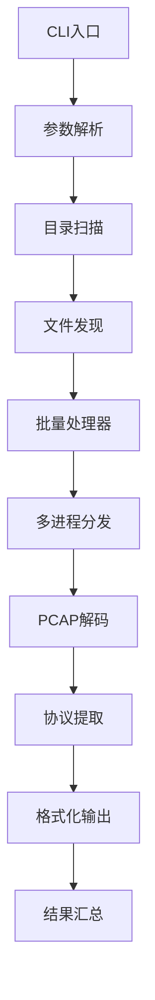
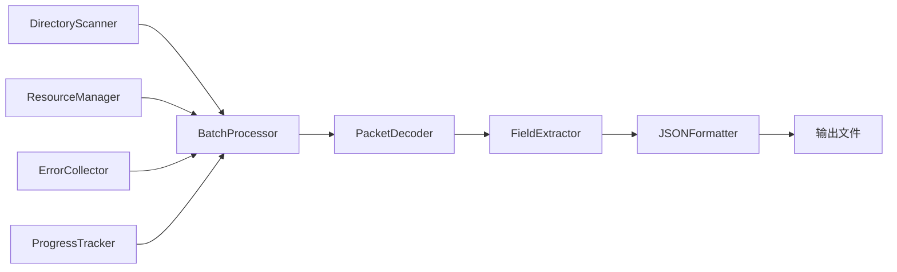

# PCAP批量解码器 - 开发者指南

## 目录

1. [项目架构](#项目架构)
2. [开发环境设置](#开发环境设置)
3. [代码结构](#代码结构)
4. [API参考](#api参考)
5. [测试指南](#测试指南)
6. [扩展开发](#扩展开发)
7. [贡献指南](#贡献指南)
8. [发布流程](#发布流程)

---

## 项目架构

### 整体架构设计

PCAP批量解码器采用模块化设计，主要包含以下组件：

```
Pkt2TXT/
├── cli.py                # 命令行接口
├── core/                 # 核心功能模块
│   ├── __init__.py
│   ├── scanner.py        # 目录扫描器
│   ├── decoder.py        # PCAP解码器
│   ├── extractor.py      # 协议字段提取器
│   ├── formatter.py      # 输出格式化器
│   └── processor.py      # 批量处理器
├── utils/                # 工具模块
│   ├── __init__.py
│   ├── progress.py       # 进度条处理
│   ├── errors.py         # 错误处理
│   ├── config.py         # 配置管理
│   └── resource_manager.py # 资源管理
└── tests/                # 测试套件
    ├── __init__.py
    ├── conftest.py       # 测试配置
    └── test_*.py         # 测试文件
```

### 处理流程



### 核心组件交互



---

## 开发环境设置

### 环境要求

- **Python**: 3.7+ (推荐3.9+)
- **操作系统**: Windows 10+, macOS 10.15+, Ubuntu 18.04+
- **IDE**: PyCharm, VSCode, 或其他Python IDE
- **Git**: 版本控制

### 设置开发环境

#### 1. 克隆项目

```bash
git clone https://github.com/your-org/pcap-batch-decoder.git
cd pcap-batch-decoder
```

#### 2. 创建虚拟环境

```bash
# 创建虚拟环境
python -m venv venv

# 激活虚拟环境
# Windows
venv\Scripts\activate
# macOS/Linux
source venv/bin/activate
```

#### 3. 安装依赖

```bash
# 安装生产依赖
pip install -r requirements.txt

# 安装开发依赖
pip install -r requirements-dev.txt

# 或使用pyproject.toml
pip install -e ".[dev]"
```

#### 4. 安装pre-commit钩子

```bash
# 安装pre-commit
pip install pre-commit

# 设置钩子
pre-commit install
```

#### 5. 运行测试验证

```bash
# 运行所有测试
pytest

# 运行代码质量检查
black .
flake8 .
mypy .
```

---

## 代码结构

### 核心模块详解

#### 1. scanner.py - 目录扫描器

**主要类**: `DirectoryScanner`

**功能**:
- 递归遍历目录结构（最多2层深度）
- 识别PCAP/PCAPNG文件格式
- 文件过滤和排序
- 性能优化的文件发现算法

**核心方法**:

```python
class DirectoryScanner:
    def scan_directory(self, path: str, max_depth: int = 2) -> List[str]:
        """扫描目录并返回PCAP文件列表"""
        
    def is_pcap_file(self, filepath: str) -> bool:
        """检查文件是否为PCAP格式"""
        
    def get_scan_statistics(self) -> Dict[str, Any]:
        """获取扫描统计信息"""
```

#### 2. decoder.py - PCAP解码器

**主要类**: `PacketDecoder`

**功能**:
- PyShark集成，支持多种PCAP格式
- 包级别的协议解析
- 错误处理和恢复
- 内存优化的流式处理

**核心方法**:

```python
class PacketDecoder:
    def decode_file(self, filepath: str) -> DecodedFile:
        """解码单个PCAP文件"""
        
    def decode_packet(self, packet) -> DecodedPacket:
        """解码单个数据包"""
        
    def get_file_info(self, filepath: str) -> FileInfo:
        """获取文件基本信息"""
```

#### 3. extractor.py - 协议字段提取器

**主要类**: `FieldExtractor`

**功能**:
- 递归提取协议字段
- 智能类型转换
- 协议摘要生成
- 嵌套协议结构处理

**核心方法**:

```python
class FieldExtractor:
    def extract_fields(self, packet) -> Dict[str, Any]:
        """提取包的所有协议字段"""
        
    def extract_layer_fields(self, layer) -> Dict[str, Any]:
        """提取单层协议字段"""
        
    def generate_summary(self, packet) -> str:
        """生成包摘要"""
```

### 数据结构

#### DecodedFile

```python
@dataclass
class DecodedFile:
    file_path: str
    file_info: FileInfo
    packets: List[DecodedPacket]
    statistics: ProtocolStatistics
    decode_time: float
    errors: List[DecodeError]
```

#### DecodedPacket

```python
@dataclass
class DecodedPacket:
    packet_id: int
    timestamp: datetime
    size: int
    layers: Dict[str, Dict[str, Any]]
    summary: str
    raw_packet: Optional[Any] = None
```

#### FileInfo

```python
@dataclass
class FileInfo:
    file_name: str
    file_size: int
    packet_count: int
    file_format: str  # "pcap" or "pcapng"
    creation_time: Optional[datetime] = None
```

---

## API参考

### 核心API

#### DirectoryScanner

```python
from core.scanner import DirectoryScanner

scanner = DirectoryScanner()
files = scanner.scan_directory("./samples")
print(f"发现 {len(files)} 个文件")
```

#### PacketDecoder

```python
from core.decoder import PacketDecoder

decoder = PacketDecoder()
result = decoder.decode_file("./samples/singlevlan/vlan_test.pcap")
print(f"解码 {len(result.packets)} 个包")
```

#### FieldExtractor

```python
from core.extractor import FieldExtractor
# (需要先用decoder获取packet对象)
# packet = ...

extractor = FieldExtractor()
fields = extractor.extract_fields(packet)
```

#### BatchProcessor

```python
from core.processor import BatchProcessor

processor = BatchProcessor(
    input_dir="./samples",
    output_dir="./results",
    jobs=4
)
processor.run()
```

### 工具API

#### 进度跟踪

```python
from utils.progress import ProgressTracker

tracker = ProgressTracker(total_files=100)
tracker.start_file("test.pcap")
# ... processing ...
tracker.finish_file(packets=50, decode_time=1.5)
```

#### 错误收集

```python
from utils.errors import ErrorCollector

collector = ErrorCollector("./reports")
try:
    # ... some operation that might fail ...
    raise ValueError("Something went wrong")
except Exception as e:
    collector.add_error("test.pcap", e)

collector.generate_report()
```

#### 资源管理

```python
from utils.resource_manager import ResourceManager

manager = ResourceManager()
if manager.is_memory_critical():
    print("内存不足，请注意！")
```

---

## 测试指南

### 测试结构

```
tests/
├── unit/                 # 单元测试
│   ├── test_scanner.py
│   ├── test_decoder.py
│   ├── test_extractor.py
│   └── test_formatter.py
├── integration/          # 集成测试
│   ├── test_end_to_end.py
│   └── test_batch_processing.py
├── performance/          # 性能测试
│   └── test_benchmarks.py
└── fixtures/             # 测试数据
    ├── sample.pcap
    └── sample.pcapng
```

### 运行测试

#### 基本测试命令

```bash
# 运行所有测试
pytest

# 运行特定测试文件
pytest tests/unit/test_scanner.py

# 运行特定测试方法
pytest tests/unit/test_scanner.py::test_scan_directory

# 详细输出
pytest -v

# 显示覆盖率
pytest --cov=. --cov-report=html
```

#### 测试分类

```bash
# 只运行单元测试
pytest tests/unit/

# 只运行集成测试
pytest tests/integration/

# 只运行性能测试
pytest tests/performance/

# 运行特定标记的测试
pytest -m "not slow"
```

### 编写测试

#### 单元测试示例

```python
# tests/unit/test_scanner.py
import pytest
from pcap_decoder.core.scanner import DirectoryScanner

class TestDirectoryScanner:
    def test_scan_empty_directory(self, tmp_path):
        """测试扫描空目录"""
        scanner = DirectoryScanner()
        files = scanner.scan_directory(str(tmp_path))
        assert len(files) == 0
    
    def test_scan_with_pcap_files(self, tmp_path):
        """测试扫描包含PCAP文件的目录"""
        # 创建测试文件
        (tmp_path / "test.pcap").touch()
        (tmp_path / "test.txt").touch()  # 非PCAP文件
        
        scanner = DirectoryScanner()
        files = scanner.scan_directory(str(tmp_path))
        
        assert len(files) == 1
        assert files[0].endswith("test.pcap")
    
    def test_max_depth_limit(self, tmp_path):
        """测试最大深度限制"""
        # 创建深层目录结构
        deep_dir = tmp_path / "level1" / "level2" / "level3"
        deep_dir.mkdir(parents=True)
        (deep_dir / "deep.pcap").touch()
        
        scanner = DirectoryScanner()
        files = scanner.scan_directory(str(tmp_path), max_depth=2)
        
        # 深度限制应该阻止发现level3中的文件
        assert len(files) == 0
```

#### 集成测试示例

```python
# tests/integration/test_end_to_end.py
import pytest
import json
from pathlib import Path
from pcap_decoder.core.processor import BatchProcessor

class TestEndToEnd:
    def test_full_processing_pipeline(self, sample_pcap_files, tmp_path):
        """测试完整的处理流程"""
        processor = BatchProcessor(
            input_dir=sample_pcap_files,
            output_dir=str(tmp_path),
            max_workers=1
        )
        
        results = processor.process_all()
        
        # 验证处理结果
        assert len(results) > 0
        assert all(r.success for r in results)
        
        # 验证输出文件
        json_files = list(tmp_path.glob("*.json"))
        assert len(json_files) > 0
        
        # 验证JSON格式
        for json_file in json_files:
            with open(json_file) as f:
                data = json.load(f)
                assert "metadata" in data
                assert "file_info" in data
                assert "packets" in data
```

### 测试数据管理

#### Fixtures

```python
# tests/conftest.py
import pytest
from pathlib import Path

@pytest.fixture
def sample_pcap_files(tmp_path):
    """创建示例PCAP文件用于测试"""
    # 这里可以创建或复制真实的PCAP文件
    sample_dir = tmp_path / "samples"
    sample_dir.mkdir()
    
    # 复制测试数据
    test_data_dir = Path(__file__).parent / "fixtures"
    for pcap_file in test_data_dir.glob("*.pcap*"):
        (sample_dir / pcap_file.name).write_bytes(pcap_file.read_bytes())
    
    return str(sample_dir)

@pytest.fixture
def decoder():
    """创建解码器实例"""
    from pcap_decoder.core.decoder import PacketDecoder
    return PacketDecoder()
```

---

## 扩展开发

### 添加新协议支持

#### 1. 扩展FieldExtractor

```python
# pcap_decoder/core/extractor.py

class FieldExtractor:
    KNOWN_PROTOCOLS = {
        # ... 其他协议
        "FOO": "_extract_layer_foo"
    }

    def _extract_layer_foo(self, layer) -> Dict[str, Any]:
        # ... 提取FOO协议的字段
        return {"field1": "value1"}

    def extract_layer_fields(self, layer) -> Dict[str, Any]:
        """扩展此方法以支持新协议"""
        protocol_name = layer.layer_name.upper()
        
        # 添加新协议处理
        if protocol_name in self.KNOWN_PROTOCOLS:
            return self.KNOWN_PROTOCOLS[protocol_name](layer)
        
        # 现有协议处理...
        
    def _extract_new_protocol_fields(self, layer) -> Dict[str, Any]:
        """新协议字段提取逻辑"""
        fields = {}
        
        # 提取特定字段
        if hasattr(layer, 'custom_field'):
            fields['custom_field'] = str(layer.custom_field)
            
        return fields
        
    def _generate_new_protocol_summary(self, layer) -> str:
        """新协议摘要生成"""
        return f"NEW_PROTOCOL: {layer.summary_field}"
```

#### 2. 添加协议测试

```python
# tests/unit/test_new_protocol.py
import pytest
from pcap_decoder.core.extractor import FieldExtractor

class TestNewProtocolSupport:
    def test_new_protocol_extraction(self):
        """测试新协议字段提取"""
        extractor = FieldExtractor()
        
        # 创建模拟的协议层
        mock_layer = MockNewProtocolLayer()
        fields = extractor._extract_new_protocol_fields(mock_layer)
        
        assert 'custom_field' in fields
        assert fields['custom_field'] == 'expected_value'
```

### 添加新输出格式

#### 1. 创建新的格式化器

```python
# pcap_decoder/core/formatters/xml_formatter.py
from abc import ABC, abstractmethod
from typing import Dict, Any
import xml.etree.ElementTree as ET

class BaseFormatter(ABC):
    @abstractmethod
    def format(self, data: Dict[str, Any]) -> str:
        pass

class XMLFormatter(BaseFormatter):
    def format(self, data: Dict[str, Any]) -> str:
        """将数据格式化为XML"""
        root = ET.Element("pcap_data")
        
        # 添加元数据
        metadata = ET.SubElement(root, "metadata")
        for key, value in data.get("metadata", {}).items():
            elem = ET.SubElement(metadata, key)
            elem.text = str(value)
        
        # 添加包数据
        packets = ET.SubElement(root, "packets")
        for packet in data.get("packets", []):
            packet_elem = ET.SubElement(packets, "packet")
            packet_elem.set("id", str(packet["packet_id"]))
            # ... 更多XML构建逻辑
        
        return ET.tostring(root, encoding='unicode')
```

#### 2. 集成到CLI

```python
# pcap_decoder/cli.py
@click.option('--format', type=click.Choice(['json', 'xml', 'csv']), 
              default='json', help='输出格式')
def main(input_dir, output_dir, format, **kwargs):
    # 根据格式选择格式化器
    formatter_map = {
        'json': JSONFormatter(),
        'xml': XMLFormatter(),
        'csv': CSVFormatter(),
    }
    
    formatter = formatter_map[format]
    # ... 使用格式化器
```

### 自定义处理插件

#### 1. 定义插件接口

```python
# pcap_decoder/plugins/base.py
from abc import ABC, abstractmethod
from typing import Any, Dict

class ProcessingPlugin(ABC):
    @abstractmethod
    def process_packet(self, packet: Dict[str, Any]) -> Dict[str, Any]:
        """处理单个包"""
        pass
    
    @abstractmethod
    def process_file(self, file_data: Dict[str, Any]) -> Dict[str, Any]:
        """处理整个文件"""
        pass
```

#### 2. 实现自定义插件

```python
# plugins/privacy_filter.py
from pcap_decoder.plugins.base import ProcessingPlugin

class PrivacyFilterPlugin(ProcessingPlugin):
    def process_packet(self, packet: Dict[str, Any]) -> Dict[str, Any]:
        """过滤敏感信息"""
        # 移除或匿名化IP地址
        if 'IP' in packet.get('layers', {}):
            packet['layers']['IP']['src'] = '***.***.***.**'
            packet['layers']['IP']['dst'] = '***.***.***.**'
        
        return packet
    
    def process_file(self, file_data: Dict[str, Any]) -> Dict[str, Any]:
        """文件级别的隐私处理"""
        file_data['privacy_filtered'] = True
        return file_data
```

---

## 贡献指南

### 贡献流程

1. **Fork** 项目仓库。
2. 创建一个新的分支 (`git checkout -b feature/my-new-feature`)。
3. 提交你的代码 (`git commit -am 'Add some feature'`)。
4. **Push** 到你的分支 (`git push origin feature/my-new-feature`)。
5. 创建一个新的 **Pull Request**。

### 代码风格

请遵循 [PEP 8](https://www.python.org/dev/peps/pep-0008/) 编码规范，并使用`black`进行代码格式化。

```bash
# 格式化代码
black .

# 检查代码风格
flake8 .
```

### 测试要求

所有新功能或Bug修复都必须附带相应的测试。

```bash
# 运行测试并检查覆盖率
pytest --cov=. --cov-fail-under=90
```

### 安全策略

我们使用`bandit`进行安全漏洞扫描。

```bash
bandit -r .
```

---

## 发布流程

### 版本管理

项目使用 [Semantic Versioning 2.0.0](https://semver.org/)。

- **MAJOR** version when you make incompatible API changes,
- **MINOR** version when you add functionality in a backwards compatible manner, and
- **PATCH** version when you make backwards compatible bug fixes.

### 发布步骤

1. **更新版本号**:
   - 在 `__init__.py` (或 `_version.py`) 中更新版本号。
   - 更新 `CHANGELOG.md`。

2. **代码检查与测试**:
   ```bash
   black .
   flake8 .
   mypy .
   pytest --cov=. --cov-report=xml
   ```

3. **创建Git标签**:
   ```bash
   git tag -a v1.2.3 -m "Version 1.2.3"
   git push origin v1.2.3
   ```

4. **构建发布包**:
   ```bash
   python setup.py sdist bdist_wheel
   ```

5. **上传到PyPI**:
   ```bash
   twine upload dist/*
   ```

## 附录

### 关键依赖项

- **PyShark**: `pyshark` - 核心解码库，tshark的Python封装。
- **Click**: `click` - 命令行界面库。
- **tqdm**: `tqdm` - 进度条库。

### 历史版本

- **1.0.0 (2024-07-25)**: 首次发布，完成核心功能。
- **0.1.0 (2024-07-15)**: 内部测试版。

### 常见问题

- **Q: 为什么解码速度慢?**
  - A: PyShark依赖于tshark进程，通信开销较大。请使用并发处理 `-j` 选项加速。

- **Q: 如何处理超大文件?**
  - A: 使用 `--max-packets` 限制处理的包数，避免内存耗尽。

- **Q: 为什么需要root权限?**
  - A: 在某些系统上，tshark可能需要root权限才能访问网络接口，但本工具处理的是文件，通常不需要root。

---

*开发者指南版本: 1.0.0*  
*最后更新: 2024-06-12* 