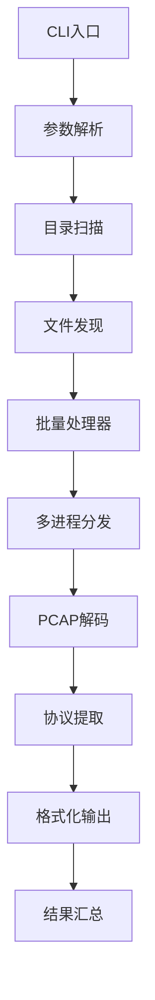
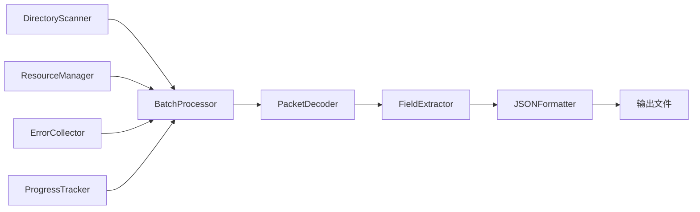

# PCAP批量解码器 - 开发者指南

## 目录

1. [项目架构](#项目架构)
2. [开发环境设置](#开发环境设置)
3. [代码结构](#代码结构)
4. [API参考](#api参考)
5. [测试指南](#测试指南)
6. [扩展开发](#扩展开发)
7. [贡献指南](#贡献指南)
8. [发布流程](#发布流程)

---

## 项目架构

### 整体架构设计

PCAP批量解码器采用模块化设计，主要包含以下组件：

```
pcap_decoder/
├── __init__.py           # 包初始化
├── __main__.py           # 主入口点
├── cli.py                # 命令行接口
├── core/                 # 核心功能模块
│   ├── __init__.py
│   ├── scanner.py        # 目录扫描器
│   ├── decoder.py        # PCAP解码器
│   ├── extractor.py      # 协议字段提取器
│   ├── formatter.py      # 输出格式化器
│   └── processor.py      # 批量处理器
├── utils/                # 工具模块
│   ├── __init__.py
│   ├── progress.py       # 进度条处理
│   ├── errors.py         # 错误处理
│   ├── config.py         # 配置管理
│   └── resource_manager.py # 资源管理
└── tests/                # 测试套件
    ├── __init__.py
    ├── conftest.py       # 测试配置
    └── test_*.py         # 测试文件
```

### 处理流程



### 核心组件交互



---

## 开发环境设置

### 环境要求

- **Python**: 3.7+ (推荐3.9+)
- **操作系统**: Windows 10+, macOS 10.15+, Ubuntu 18.04+
- **IDE**: PyCharm, VSCode, 或其他Python IDE
- **Git**: 版本控制

### 设置开发环境

#### 1. 克隆项目

```bash
git clone https://github.com/your-org/pcap-batch-decoder.git
cd pcap-batch-decoder
```

#### 2. 创建虚拟环境

```bash
# 创建虚拟环境
python -m venv venv

# 激活虚拟环境
# Windows
venv\Scripts\activate
# macOS/Linux
source venv/bin/activate
```

#### 3. 安装依赖

```bash
# 安装生产依赖
pip install -r requirements.txt

# 安装开发依赖
pip install -r requirements-dev.txt

# 或使用pyproject.toml
pip install -e ".[dev]"
```

#### 4. 安装pre-commit钩子

```bash
# 安装pre-commit
pip install pre-commit

# 设置钩子
pre-commit install
```

#### 5. 运行测试验证

```bash
# 运行所有测试
pytest

# 运行代码质量检查
black pcap_decoder/
flake8 pcap_decoder/
mypy pcap_decoder/
```

---

## 代码结构

### 核心模块详解

#### 1. scanner.py - 目录扫描器

**主要类**: `DirectoryScanner`

**功能**:
- 递归遍历目录结构（最多2层深度）
- 识别PCAP/PCAPNG文件格式
- 文件过滤和排序
- 性能优化的文件发现算法

**核心方法**:

```python
class DirectoryScanner:
    def scan_directory(self, path: str, max_depth: int = 2) -> List[str]:
        """扫描目录并返回PCAP文件列表"""
        
    def is_pcap_file(self, filepath: str) -> bool:
        """检查文件是否为PCAP格式"""
        
    def get_scan_statistics(self) -> Dict[str, Any]:
        """获取扫描统计信息"""
```

#### 2. decoder.py - PCAP解码器

**主要类**: `PacketDecoder`

**功能**:
- PyShark集成，支持多种PCAP格式
- 包级别的协议解析
- 错误处理和恢复
- 内存优化的流式处理

**核心方法**:

```python
class PacketDecoder:
    def decode_file(self, filepath: str) -> DecodedFile:
        """解码单个PCAP文件"""
        
    def decode_packet(self, packet) -> DecodedPacket:
        """解码单个数据包"""
        
    def get_file_info(self, filepath: str) -> FileInfo:
        """获取文件基本信息"""
```

#### 3. extractor.py - 协议字段提取器

**主要类**: `FieldExtractor`

**功能**:
- 递归提取协议字段
- 智能类型转换
- 协议摘要生成
- 嵌套协议结构处理

**核心方法**:

```python
class FieldExtractor:
    def extract_fields(self, packet) -> Dict[str, Any]:
        """提取包的所有协议字段"""
        
    def extract_layer_fields(self, layer) -> Dict[str, Any]:
        """提取单层协议字段"""
        
    def generate_summary(self, packet) -> str:
        """生成包摘要"""
```

### 数据结构

#### DecodedFile

```python
@dataclass
class DecodedFile:
    file_path: str
    file_info: FileInfo
    packets: List[DecodedPacket]
    statistics: ProtocolStatistics
    decode_time: float
    errors: List[DecodeError]
```

#### DecodedPacket

```python
@dataclass
class DecodedPacket:
    packet_id: int
    timestamp: datetime
    size: int
    layers: Dict[str, Dict[str, Any]]
    summary: str
    raw_packet: Optional[Any] = None
```

#### FileInfo

```python
@dataclass
class FileInfo:
    file_name: str
    file_size: int
    packet_count: int
    file_format: str  # "pcap" or "pcapng"
    creation_time: Optional[datetime] = None
```

---

## API参考

### 核心API

#### DirectoryScanner

```python
from pcap_decoder.core.scanner import DirectoryScanner

scanner = DirectoryScanner()

# 扫描目录
files = scanner.scan_directory("/path/to/pcaps", max_depth=2)

# 获取统计信息
stats = scanner.get_scan_statistics()
print(f"找到 {stats['found_files']} 个文件")
```

#### PacketDecoder

```python
from pcap_decoder.core.decoder import PacketDecoder

decoder = PacketDecoder()

# 解码单个文件
result = decoder.decode_file("/path/to/file.pcap")

# 访问解码结果
print(f"解码了 {len(result.packets)} 个包")
for packet in result.packets[:5]:  # 查看前5个包
    print(f"包 {packet.packet_id}: {packet.summary}")
```

#### FieldExtractor

```python
from pcap_decoder.core.extractor import FieldExtractor

extractor = FieldExtractor()

# 提取字段（通常由PacketDecoder内部调用）
fields = extractor.extract_fields(pyshark_packet)

# 生成摘要
summary = extractor.generate_summary(pyshark_packet)
```

#### BatchProcessor

```python
from pcap_decoder.core.processor import BatchProcessor

processor = BatchProcessor(
    input_dir="/path/to/pcaps",
    output_dir="/path/to/output",
    max_workers=4,
    max_packets_per_file=1000
)

# 开始批量处理
results = processor.process_all()

# 查看处理结果
for result in results:
    if result.success:
        print(f"✅ {result.file_path}")
    else:
        print(f"❌ {result.file_path}: {result.error}")
```

### 工具API

#### 进度跟踪

```python
from pcap_decoder.utils.progress import ProgressTracker

# 创建进度跟踪器
progress = ProgressTracker(total_files=100)

# 更新进度
for i in range(100):
    progress.update(1, current_file=f"file_{i}.pcap")
    time.sleep(0.1)

progress.close()
```

#### 错误收集

```python
from pcap_decoder.utils.errors import ErrorCollector

collector = ErrorCollector()

# 记录错误
try:
    # 一些可能失败的操作
    decode_file(problematic_file)
except Exception as e:
    collector.add_error("decode_error", str(e), problematic_file)

# 生成错误报告
report = collector.generate_report()
```

#### 资源管理

```python
from pcap_decoder.utils.resource_manager import ResourceManager

# 创建资源管理器
rm = ResourceManager(max_memory_mb=1000)

# 检查资源
if rm.check_memory():
    # 执行内存密集型操作
    process_large_file()

# 清理资源
rm.cleanup()
```

---

## 测试指南

### 测试结构

```
tests/
├── unit/                 # 单元测试
│   ├── test_scanner.py
│   ├── test_decoder.py
│   ├── test_extractor.py
│   └── test_formatter.py
├── integration/          # 集成测试
│   ├── test_end_to_end.py
│   └── test_batch_processing.py
├── performance/          # 性能测试
│   └── test_benchmarks.py
└── fixtures/             # 测试数据
    ├── sample.pcap
    └── sample.pcapng
```

### 运行测试

#### 基本测试命令

```bash
# 运行所有测试
pytest

# 运行特定测试文件
pytest tests/unit/test_scanner.py

# 运行特定测试方法
pytest tests/unit/test_scanner.py::test_scan_directory

# 详细输出
pytest -v

# 显示覆盖率
pytest --cov=pcap_decoder --cov-report=html
```

#### 测试分类

```bash
# 只运行单元测试
pytest tests/unit/

# 只运行集成测试
pytest tests/integration/

# 只运行性能测试
pytest tests/performance/

# 运行特定标记的测试
pytest -m "not slow"
```

### 编写测试

#### 单元测试示例

```python
# tests/unit/test_scanner.py
import pytest
from pcap_decoder.core.scanner import DirectoryScanner

class TestDirectoryScanner:
    def test_scan_empty_directory(self, tmp_path):
        """测试扫描空目录"""
        scanner = DirectoryScanner()
        files = scanner.scan_directory(str(tmp_path))
        assert len(files) == 0
    
    def test_scan_with_pcap_files(self, tmp_path):
        """测试扫描包含PCAP文件的目录"""
        # 创建测试文件
        (tmp_path / "test.pcap").touch()
        (tmp_path / "test.txt").touch()  # 非PCAP文件
        
        scanner = DirectoryScanner()
        files = scanner.scan_directory(str(tmp_path))
        
        assert len(files) == 1
        assert files[0].endswith("test.pcap")
    
    def test_max_depth_limit(self, tmp_path):
        """测试最大深度限制"""
        # 创建深层目录结构
        deep_dir = tmp_path / "level1" / "level2" / "level3"
        deep_dir.mkdir(parents=True)
        (deep_dir / "deep.pcap").touch()
        
        scanner = DirectoryScanner()
        files = scanner.scan_directory(str(tmp_path), max_depth=2)
        
        # 深度限制应该阻止发现level3中的文件
        assert len(files) == 0
```

#### 集成测试示例

```python
# tests/integration/test_end_to_end.py
import pytest
import json
from pathlib import Path
from pcap_decoder.core.processor import BatchProcessor

class TestEndToEnd:
    def test_full_processing_pipeline(self, sample_pcap_files, tmp_path):
        """测试完整的处理流程"""
        processor = BatchProcessor(
            input_dir=sample_pcap_files,
            output_dir=str(tmp_path),
            max_workers=1
        )
        
        results = processor.process_all()
        
        # 验证处理结果
        assert len(results) > 0
        assert all(r.success for r in results)
        
        # 验证输出文件
        json_files = list(tmp_path.glob("*.json"))
        assert len(json_files) > 0
        
        # 验证JSON格式
        for json_file in json_files:
            with open(json_file) as f:
                data = json.load(f)
                assert "metadata" in data
                assert "file_info" in data
                assert "packets" in data
```

### 测试数据管理

#### Fixtures

```python
# tests/conftest.py
import pytest
from pathlib import Path

@pytest.fixture
def sample_pcap_files(tmp_path):
    """创建示例PCAP文件用于测试"""
    # 这里可以创建或复制真实的PCAP文件
    sample_dir = tmp_path / "samples"
    sample_dir.mkdir()
    
    # 复制测试数据
    test_data_dir = Path(__file__).parent / "fixtures"
    for pcap_file in test_data_dir.glob("*.pcap*"):
        (sample_dir / pcap_file.name).write_bytes(pcap_file.read_bytes())
    
    return str(sample_dir)

@pytest.fixture
def decoder():
    """创建解码器实例"""
    from pcap_decoder.core.decoder import PacketDecoder
    return PacketDecoder()
```

---

## 扩展开发

### 添加新协议支持

#### 1. 扩展FieldExtractor

```python
# pcap_decoder/core/extractor.py

class FieldExtractor:
    def extract_layer_fields(self, layer) -> Dict[str, Any]:
        """扩展此方法以支持新协议"""
        protocol_name = layer.layer_name.upper()
        
        # 添加新协议处理
        if protocol_name == "NEW_PROTOCOL":
            return self._extract_new_protocol_fields(layer)
        
        # 现有协议处理...
        
    def _extract_new_protocol_fields(self, layer) -> Dict[str, Any]:
        """新协议字段提取逻辑"""
        fields = {}
        
        # 提取特定字段
        if hasattr(layer, 'custom_field'):
            fields['custom_field'] = str(layer.custom_field)
            
        return fields
        
    def _generate_new_protocol_summary(self, layer) -> str:
        """新协议摘要生成"""
        return f"NEW_PROTOCOL: {layer.summary_field}"
```

#### 2. 添加协议测试

```python
# tests/unit/test_new_protocol.py
import pytest
from pcap_decoder.core.extractor import FieldExtractor

class TestNewProtocolSupport:
    def test_new_protocol_extraction(self):
        """测试新协议字段提取"""
        extractor = FieldExtractor()
        
        # 创建模拟的协议层
        mock_layer = MockNewProtocolLayer()
        fields = extractor._extract_new_protocol_fields(mock_layer)
        
        assert 'custom_field' in fields
        assert fields['custom_field'] == 'expected_value'
```

### 添加新输出格式

#### 1. 创建新的格式化器

```python
# pcap_decoder/core/formatters/xml_formatter.py
from abc import ABC, abstractmethod
from typing import Dict, Any
import xml.etree.ElementTree as ET

class BaseFormatter(ABC):
    @abstractmethod
    def format(self, data: Dict[str, Any]) -> str:
        pass

class XMLFormatter(BaseFormatter):
    def format(self, data: Dict[str, Any]) -> str:
        """将数据格式化为XML"""
        root = ET.Element("pcap_data")
        
        # 添加元数据
        metadata = ET.SubElement(root, "metadata")
        for key, value in data.get("metadata", {}).items():
            elem = ET.SubElement(metadata, key)
            elem.text = str(value)
        
        # 添加包数据
        packets = ET.SubElement(root, "packets")
        for packet in data.get("packets", []):
            packet_elem = ET.SubElement(packets, "packet")
            packet_elem.set("id", str(packet["packet_id"]))
            # ... 更多XML构建逻辑
        
        return ET.tostring(root, encoding='unicode')
```

#### 2. 集成到CLI

```python
# pcap_decoder/cli.py
@click.option('--format', type=click.Choice(['json', 'xml', 'csv']), 
              default='json', help='输出格式')
def main(input_dir, output_dir, format, **kwargs):
    # 根据格式选择格式化器
    formatter_map = {
        'json': JSONFormatter(),
        'xml': XMLFormatter(),
        'csv': CSVFormatter(),
    }
    
    formatter = formatter_map[format]
    # ... 使用格式化器
```

### 自定义处理插件

#### 1. 定义插件接口

```python
# pcap_decoder/plugins/base.py
from abc import ABC, abstractmethod
from typing import Any, Dict

class ProcessingPlugin(ABC):
    @abstractmethod
    def process_packet(self, packet: Dict[str, Any]) -> Dict[str, Any]:
        """处理单个包"""
        pass
    
    @abstractmethod
    def process_file(self, file_data: Dict[str, Any]) -> Dict[str, Any]:
        """处理整个文件"""
        pass
```

#### 2. 实现自定义插件

```python
# plugins/privacy_filter.py
from pcap_decoder.plugins.base import ProcessingPlugin

class PrivacyFilterPlugin(ProcessingPlugin):
    def process_packet(self, packet: Dict[str, Any]) -> Dict[str, Any]:
        """过滤敏感信息"""
        # 移除或匿名化IP地址
        if 'IP' in packet.get('layers', {}):
            packet['layers']['IP']['src'] = '***.***.***.**'
            packet['layers']['IP']['dst'] = '***.***.***.**'
        
        return packet
    
    def process_file(self, file_data: Dict[str, Any]) -> Dict[str, Any]:
        """文件级别的隐私处理"""
        file_data['privacy_filtered'] = True
        return file_data
```

---

## 贡献指南

### 贡献流程

1. **Fork项目**
   ```bash
   # Fork GitHub仓库
   # 克隆你的fork
   git clone https://github.com/your-username/pcap-batch-decoder.git
   ```

2. **创建特性分支**
   ```bash
   git checkout -b feature/new-protocol-support
   ```

3. **开发和测试**
   ```bash
   # 编写代码
   # 运行测试
   pytest
   # 代码质量检查
   black . && flake8 . && mypy .
   ```

4. **提交变更**
   ```bash
   git add .
   git commit -m "feat: add support for new protocol"
   ```

5. **创建Pull Request**
   - 推送到你的fork
   - 在GitHub上创建PR
   - 描述变更内容
   - 等待代码审查

### 代码规范

#### Python编码规范

```python
# 遵循PEP 8
# 使用类型提示
def process_file(filepath: str, max_packets: Optional[int] = None) -> DecodedFile:
    """处理PCAP文件
    
    Args:
        filepath: PCAP文件路径
        max_packets: 最大处理包数，None表示无限制
        
    Returns:
        解码后的文件对象
        
    Raises:
        FileNotFoundError: 文件不存在
        DecodeError: 解码失败
    """
    pass

# 使用dataclass定义数据结构
@dataclass
class PacketInfo:
    packet_id: int
    timestamp: datetime
    size: int
    
# 遵循命名规范
class ProtocolParser:  # 类使用PascalCase
    def parse_packet(self, packet_data: bytes) -> Dict[str, Any]:  # 方法使用snake_case
        protocol_type = self._detect_protocol(packet_data)  # 私有方法用下划线
        return {}
```

#### 提交信息规范

```bash
# 格式: <type>(<scope>): <description>

# 类型:
feat: 新功能
fix: 修复bug
docs: 文档更新
style: 代码格式修改
refactor: 重构
test: 测试相关
chore: 构建过程或辅助工具的变动

# 示例:
feat(decoder): add support for MPLS protocol
fix(scanner): handle unicode filename correctly
docs(api): update decoder API documentation
test(extractor): add tests for IPv6 extraction
```

### 代码审查清单

#### Pull Request检查项

- [ ] 代码通过所有测试
- [ ] 新功能有相应的测试
- [ ] 代码覆盖率不低于80%
- [ ] 遵循代码规范（black, flake8, mypy）
- [ ] 文档已更新
- [ ] 变更日志已更新
- [ ] API文档已更新（如有必要）
- [ ] 性能影响已评估
- [ ] 向后兼容性已考虑

#### 代码质量标准

```bash
# 运行完整的质量检查
# 代码格式化
black pcap_decoder/ tests/

# 代码风格检查
flake8 pcap_decoder/ tests/

# 类型检查
mypy pcap_decoder/

# 测试覆盖率
pytest --cov=pcap_decoder --cov-report=html --cov-fail-under=80

# 安全检查
bandit -r pcap_decoder/

# 依赖检查
safety check
```

---

## 发布流程

### 版本管理

项目使用[语义化版本](https://semver.org/)：

- **主版本号**: 不兼容的API修改
- **次版本号**: 向下兼容的功能性新增
- **修订版本号**: 向下兼容的问题修正

### 发布步骤

#### 1. 准备发布

```bash
# 1. 确保在main分支
git checkout main
git pull origin main

# 2. 更新版本号
# 编辑pyproject.toml中的version字段
# 更新__init__.py中的__version__

# 3. 更新CHANGELOG.md
# 添加新版本的变更记录

# 4. 运行完整测试
pytest
black . && flake8 . && mypy .
```

#### 2. 创建发布标签

```bash
# 创建标签
git tag v1.0.0

# 推送标签
git push origin v1.0.0
```

#### 3. 构建分发包

```bash
# 安装构建工具
pip install build twine

# 清理旧的构建
rm -rf dist/ build/

# 构建分发包
python -m build

# 检查分发包
twine check dist/*
```

#### 4. 发布到PyPI

```bash
# 发布到测试PyPI（可选）
twine upload --repository testpypi dist/*

# 测试安装
pip install --index-url https://test.pypi.org/simple/ pcap-batch-decoder

# 发布到正式PyPI
twine upload dist/*
```

#### 5. 创建GitHub Release

1. 访问GitHub仓库的Releases页面
2. 点击"Create a new release"
3. 选择刚创建的标签
4. 填写Release标题和描述
5. 上传构建的分发包
6. 发布Release

### 自动化CI/CD

#### GitHub Actions配置

```yaml
# .github/workflows/ci.yml
name: CI

on:
  push:
    branches: [ main, develop ]
  pull_request:
    branches: [ main ]

jobs:
  test:
    runs-on: ubuntu-latest
    strategy:
      matrix:
        python-version: [3.7, 3.8, 3.9, 3.10, 3.11]
    
    steps:
    - uses: actions/checkout@v3
    
    - name: Set up Python
      uses: actions/setup-python@v3
      with:
        python-version: ${{ matrix.python-version }}
    
    - name: Install dependencies
      run: |
        python -m pip install --upgrade pip
        pip install -e ".[dev]"
    
    - name: Run tests
      run: |
        pytest --cov=pcap_decoder --cov-report=xml
    
    - name: Upload coverage
      uses: codecov/codecov-action@v3

  release:
    needs: test
    runs-on: ubuntu-latest
    if: github.event_name == 'push' && startsWith(github.ref, 'refs/tags/')
    
    steps:
    - uses: actions/checkout@v3
    
    - name: Set up Python
      uses: actions/setup-python@v3
      with:
        python-version: 3.9
    
    - name: Build package
      run: |
        pip install build
        python -m build
    
    - name: Publish to PyPI
      uses: pypa/gh-action-pypi-publish@release/v1
      with:
        password: ${{ secrets.PYPI_API_TOKEN }}
```

---

## 架构决策记录

### ADR-001: 选择PyShark作为解码引擎

**状态**: 已接受  
**日期**: 2024-06-06

**背景**: 需要选择PCAP解码库

**决策**: 选择PyShark而不是Scapy或其他库

**理由**:
- 基于tshark，协议支持最全面
- 解码准确性高
- 活跃的社区支持

**后果**:
- 依赖Wireshark/tshark安装
- 性能相对较慢
- 需要处理tshark的异常情况

### ADR-002: 采用多进程而非多线程

**状态**: 已接受  
**日期**: 2024-06-08

**背景**: 需要提升批量处理性能

**决策**: 使用multiprocessing而不是threading

**理由**:
- 避免GIL限制
- 更好的CPU利用率
- 进程隔离，错误不会相互影响

**后果**:
- 内存使用增加
- 进程间通信复杂
- 序列化开销

---

*开发者指南版本: 1.0.0*  
*最后更新: 2024-06-12* 